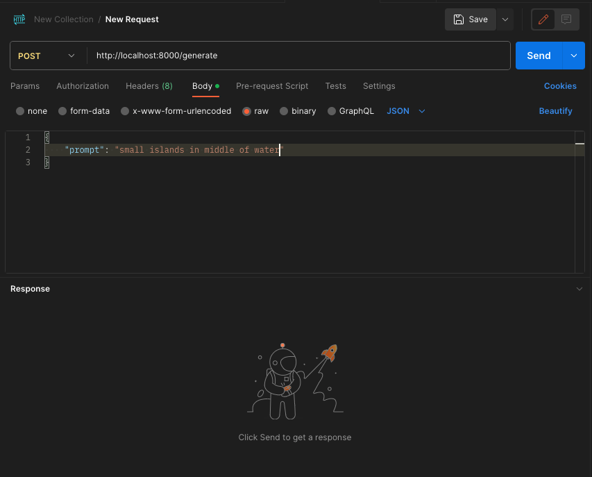
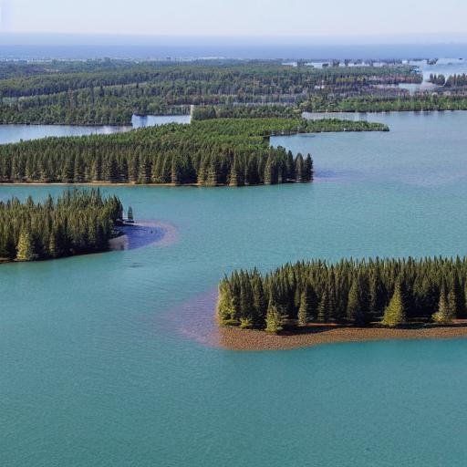

# Narrative Visuals: AI's take on Image Crafting

This project aims to harness the power of Artificial Intelligence to create a state-of-the-art image generation system. This is done by inputting text prompts to the system which will utilise advanced AI algorithms to synthesise highly detailed and accurate visual representation.

In this project, we implemented a custom-built diffusion pipeline using various pre-trained models. The generate function translates textual prompts into images. It employs a blend of CLIP text encoding, diffusion models, and neural network architectures like UNet and Variational AutoEncoders (VAEs). The process can be broken down into several stages:

- Text Encoding
- Initiation of the Diffusion Process
- Iterative Denoising
- Image Reconstruction

1. **Text Encoding**

  - _Purpose_: Transforms the input text into machine-understandable encodings. 
  - _Process_: The text prompt is passed through the CLIP text encoder, which outputs a feature vector representing the text. This vector encodes the semantics of the prompt in a format that the image generation model can utilize.
2. **Initiation of the Diffusion Process**
- _Initial Latent Space Generation_: The function initializes a random noise latent space (init_latent). This latent space serves as the starting point for the diffusion process.
- _Noise Scheduling_: The scheduler sets the number of timesteps for the diffusion process, indicating how the noise will be added and subsequently reduced.
3. **Iterative Denoising**
- _Diffusion Mechanism_: The core of the image generation lies in the diffusion process. It starts with a noisy image and iteratively denoises it.
- _UNet Architecture_: The UNet model predicts the noise at each timestep. It uses cross-attention layers with the text encoder, ensuring the noise is relevant to the input prompt.
- _Guidance Scale_: Adjusts the degree to which the model follows the text prompt versus generating freely. A higher guidance scale makes the model adhere more closely to the prompt.
- _Denoising Steps_: At each timestep, the model updates the latent space by removing a portion of the noise, guided by the predicted noise pattern and the guidance scale.
4. **Image Reconstruction**
- _Decoder Functionality_: After the iterative denoising, a latent image representation is formed. This is then passed through a decoder, typically from a VAE, to transform it into a high-resolution image.
- _Resolution Parameter_: Determines the final resolution of the generated image.

**Additional Features**
- _Random State_: Ensures reproducibility by setting a fixed random seed.
- _Save Steps_: An optional feature to save intermediate latent representations during the diffusion process, useful for analysis and debugging.


# Contrastive Learning Image Pre-trained
The main challenge in generative AI especially when we are generating images using prompts we need an efficient way to combine images and text. The key innovation of CLIP is its ability to create a shared representation space for both images and text, allowing the AI to understand how textual descriptions correlate with visual elements

**Dual-Component** Architecture
- _Image Encoder_: This part of CLIP processes the visual information. It takes an image and converts it into a feature vector—a set of numerical values representing different aspects of the image. This encoder is usually a deep convolutional neural network (CNN) trained to recognize a wide variety of visual features.

- _Text Encoder_: Parallel to the image encoder, the text encoder processes the textual information. It takes a text input (like a caption or a prompt) and converts it into a similar feature vector. This encoder is typically a transformer-based neural network, trained to understand language and its nuances.

**Training Process**
- _Contrastive Learning_: CLIP is trained using a technique called contrastive learning. During training, CLIP is presented with pairs of text and images, as well as mismatched pairs. The model learns to align the text and image feature vectors when they correspond to each other and to differentiate them when they do not.

- _Optimization Goal_: The aim is to maximize the similarity between the vectors of matching text-image pairs while minimizing the similarity between vectors of non-matching pairs. This approach teaches the model to understand the relationship between text and images at a fundamental level.


# U-Net Architecture:
U-Net, originally developed for biomedical image segmentation, has become a pivotal architecture in various image processing tasks, including generative models like Stable Diffusion. Its design is particularly effective for detailed and precise work on images, making it well-suited for tasks requiring fine control and accuracy.

**Core Structure**
- _Symmetrical Design_: U-Net's architecture resembles the letter 'U', featuring a downsampling path (encoder) and an upsampling path (decoder) connected by a 'bridge'.
- _Encoder_: The encoder consists of a series of convolutional layers and pooling layers. It captures the context of the image, effectively reducing its spatial dimensions while increasing the depth (number of feature channels).
- _Bridge_: This component connects the encoder and decoder. It typically consists of convolutional layers that process the deepest, most compressed representation of the input data.
- _Decoder_: The decoder upsamples the feature maps back to the original image size. It uses transposed convolutions or upsampling followed by convolution. Crucially, it includes skip connections from layers of the encoder.
- _Skip Connections_: They are the defining feature of U-Net, connecting layers of the encoder to corresponding layers in the decoder. These connections help in preserving fine-grained details by passing high-resolution features directly to the decoder.


# Variational Auto Encoder:

Variational Autoencoders (VAEs) are a class of generative models that find extensive use in the fields of machine learning and deep learning for tasks such as image generation, denoising, and feature extraction. They are particularly known for their ability to learn latent representations of data in an unsupervised manner.

**Key Areas**
- _Autoencoder Basis_: VAEs build upon the traditional autoencoder model, which consists of two main components: an encoder and a decoder. The encoder compresses the input into a lower-dimensional latent space, and the decoder reconstructs the input from this compressed representation.
- _Probabilistic Approach_: Unlike standard autoencoders, VAEs introduce a probabilistic twist. They model the latent space using probability distributions, typically Gaussian, adding a degree of randomness and variation to the process.

**VAE Architecture Components**
- **_Encoder_**:
    - _Function_: Maps the input data to a distribution in latent space.
    - _Output_: Rather than outputting a single point in the latent space, it outputs parameters of a probability distribution (mean and variance).

- **_Latent Space_**:

    - _Representation_: Encoded as a probability distribution, typically Gaussian.
    - _Sampling_: Random samples are drawn from this distribution to generate outputs, introducing variability.
- **_Decoder_**:

    - _Reconstruction_: Takes a sample from the latent space and reconstructs the input data.
    - _Flexibility_: The decoder learns to reconstruct inputs from noisy, varied latent representations.

**Training Process**
- _Loss Function_: VAEs use a unique loss function, comprising two terms:
- _Reconstruction Loss_: Measures how well the decoder can reconstruct the input data from the latent space.
- _Kullback-Leibler Divergence (KL Divergence)_: Ensures the distribution of the latent space remains close to the prior distribution (typically a standard normal distribution). This term regularizes the model and prevents overfitting.
- _Backpropagation and Optimization_: Like other neural networks, VAEs use backpropagation and gradient descent-based optimization to train the model.


# How to execute the project:

- Create  a virtual environment with the provided requirements.txt
- To host this application on a API, we need to run the following command. Once it is executed the server will be started on local host on port number 8000.

```commandline
python manage.py runserver
```

- To hit the local server we will be using Postman by sending a post request like below.

- The response would be an image which is encoded in base64 format.



